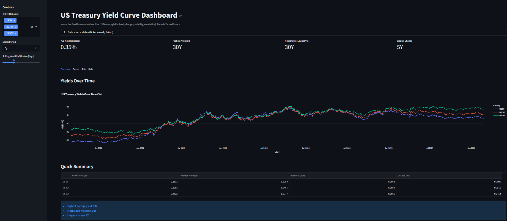
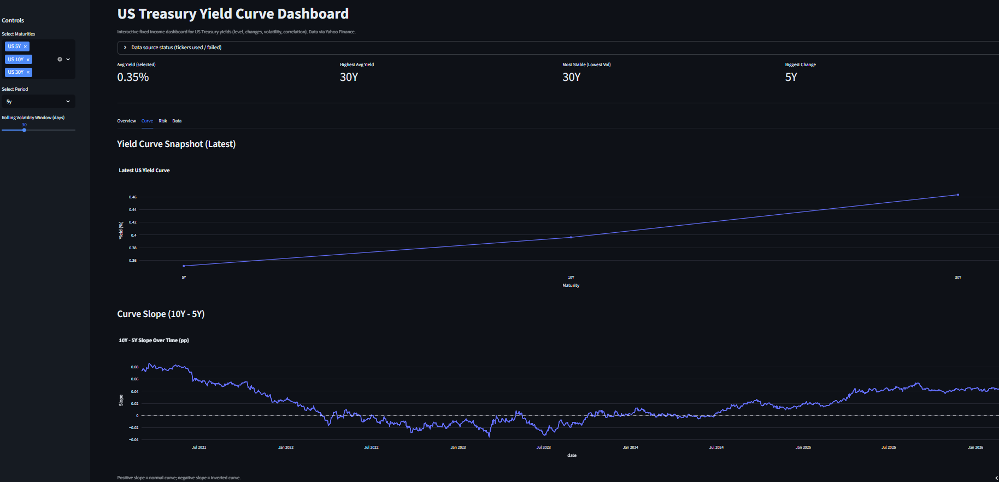
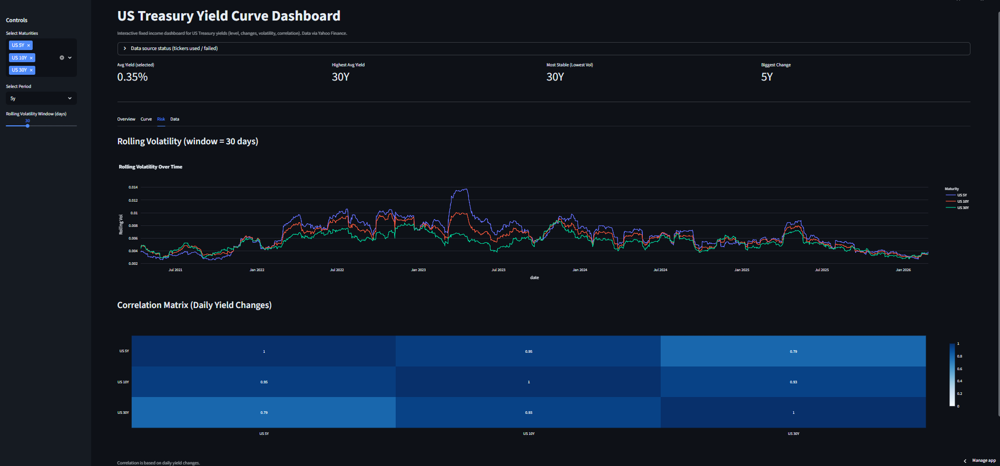

# US Treasury Yield Curve Analysis Dashboard

## Project Overview

This project presents an interactive financial dashboard designed to analyze the behavior of the US Treasury Yield Curve across three key maturities: 5-year, 10-year, and 30-year government bonds. 

The objective is to explore yield levels, volatility patterns, maturity relationships, and curve dynamics in order to better understand fixed income market behavior over time.

The dashboard enables users to dynamically select time horizons and volatility windows, allowing structured analysis of interest rate movements and term structure behavior in an intuitive and interactive format.

---

## Business & Analytical Objective

The primary objective of this project is to evaluate the structure and stability of US Treasury yields and extract meaningful financial insights relevant to macroeconomic interpretation and risk monitoring.

Specifically, the dashboard investigates:

- The evolution of yield levels across maturities
- The slope of the yield curve (10Y – 5Y spread)
- Volatility clustering across different bond tenors
- Cross-maturity correlation dynamics

Understanding yield curve behavior is critical in financial markets. Curve flattening and inversion often reflect shifts in monetary policy expectations and potential economic slowdowns. This analysis provides a structured lens to interpret such movements.

---

## Data Source

The dataset is obtained from Yahoo Finance using the `yfinance` API.

The following Treasury yield indices are used:

- US 5-Year Treasury Yield (^FVX)
- US 10-Year Treasury Yield (^TNX)
- US 30-Year Treasury Yield (^TYX)

Data is fetched dynamically at daily frequency and processed within the Streamlit application.  
Additionally, a raw CSV export (`treasury_yield_data.csv`) is included in the repository to comply with submission requirements.

---

## Methodology

The analysis consists of five core components:

### 1. Yield Level Analysis
Daily yield data is collected and visualized to observe long-term trends and structural shifts across maturities.

### 2. Yield Curve Snapshot
The latest available observation is used to construct the current yield curve, illustrating the shape of the term structure at a given point in time.

### 3. Curve Slope (10Y - 5Y Spread)
The spread between 10-year and 5-year yields is computed to evaluate curve steepness:

- Positive spread → Normal upward-sloping curve  
- Negative spread → Inverted curve (historically associated with recession risk)

### 4. Volatility Measurement
Daily yield changes are calculated and rolling standard deviation is applied to measure maturity-specific volatility behavior.

### 5. Correlation Analysis
Correlation of daily yield changes is computed to understand how maturities move relative to one another, highlighting systemic interest rate shifts.

---

## Key Insights

- Long-term maturities (30Y) generally exhibit higher average yield levels over extended horizons.
- Shorter maturities tend to display sharper short-term fluctuations during tightening cycles.
- Yield curve slope movements highlight periods of flattening and inversion, reflecting macroeconomic expectation shifts.
- Strong positive correlations (often above 0.90) suggest synchronized movement across maturities during market-wide rate adjustments.
- Volatility clustering indicates that interest rate shocks propagate across the curve rather than remaining isolated to a single tenor.

These insights can support portfolio duration management, macro risk monitoring, and fixed income strategy discussions.

---

## Dashboard Screenshots

### Overview


### Yield Curve & Slope


### Risk Analysis (Volatility & Correlation)


---

## Live Dashboard Link

You can access the live interactive dashboard here:

🔗 https://us-treasury-yield-dashboard-dqkkd2ku29yxlvu6vq5vpw.streamlit.app/

---

## Tools & Technologies Used

- Python
- Pandas
- NumPy
- yfinance API
- Plotly
- Streamlit

---

## Assumptions & Limitations

- Data is sourced from Yahoo Finance and may be subject to availability constraints.
- Analysis is performed at daily frequency only.
- Macroeconomic drivers (inflation, GDP, Fed policy decisions) are not directly incorporated.
- The project focuses on descriptive analytics rather than predictive modeling.

---

## How to Run Locally

```bash
pip install -r requirements.txt
streamlit run app.py
